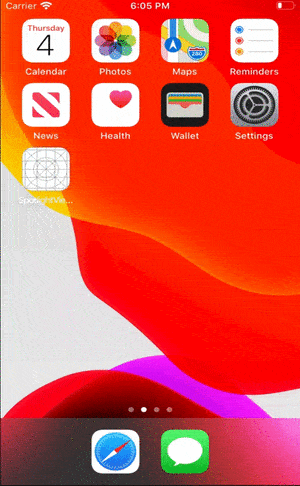
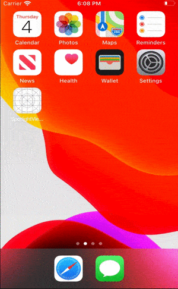

# SpotlightViewKit
**SpotlightViewKit** is a framework, which might be considered as part of onboarding process. **SpotlightView** provides a very simple API to generate spotlight effect, and zoom on different parts of UI, and moves from one to onother. Besides, it's pretty customizable (see Andvatages).

### Requirements (Programming language)

Swift 4.2 and upper.

### Support

iOS 10.0 and upper

### Functionality

- [x] **Usability** - 
- [x] **Customizability** - framework provides 2 ways to configure overlay:

1. To setup overlay with **Blur**, user should configure 5 params (**ratio**, **blurRadius**, **blendColor**, **blendMode**, **iterations**). 
Here is some set of this params and how overlay will look like (listed set is default one):

|**ratio**,CGFloat|**blurRadius**, CGFloat |**blendColor**, UIColor |**blendMode**, CGBlendMode|**iterations**, CGBlendMode|
| --------------------------:|:---------------------------------:|:---------------------------------:|:-----------------------------------:|:------------------------------------:|
|           1.0              |                80.0               |                gray               |             destinationOver         |               3                      |

.

2.  To setup overlay with **Color**, user should configure 3 params (**color**, **blendMode**, **alpha**). 
Here is some set of this params and how overlay will look like:

|**color**, UIColor|**blendMode**, CGBlendMode |**alpha**, CGFloat |
| --------------------------- |:------------------------------------:|:----------------------------:|
|            lightGray        |                   darken             |              0.6             |  

.